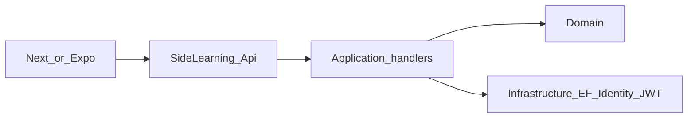

# Architecture

## Goals

This backend prioritizes **clear boundaries**, **security baselines** (Identity, JWT, refresh rotation), and **multi-client consumption** (Next.js and Expo) without turning the solution into an over-abstracted enterprise template.

## Modular monolith

The system deploys as **one ASP.NET Core process** and **one PostgreSQL database**. Features are grouped in **feature folders** inside Application, Infrastructure (EF configuration), and Api so navigation follows product concepts (Auth, Topics, …).

## Layer responsibilities

| Layer | Responsibility |
|--------|------------------|
| **Domain** | Entities, value objects, domain-centric errors/invariants. No infrastructure or framework coupling. |
| **Application** | Use cases, validation, orchestration, abstractions (`IApplicationDbContext`, `ICredentialService`, `IUserRepository`, `IAuthTokenService`). |
| **Infrastructure** | EF Core, Identity, JWT signing, refresh token storage, migrations. |
| **Api** | HTTP surface: routing, auth attributes, middleware, OpenAPI. **No business rules.** |

## Request flow

## Authentication placement

- **Identity user** (`ApplicationUser`) and **EF stores** live in **Infrastructure** for credentials and security primitives.
- **Domain user** lives in `domain_users` and is the product/business aggregate source of truth.
- **Register/login/refresh/revoke** orchestration lives in **Application** handlers; they depend on **abstractions** (`ICredentialService`, `IUserRepository`, `IAuthTokenService`).
- **JWT validation** and **Bearer** authentication are configured in **Api** (`Program.cs`).

## Authorization

`Program.cs` registers ASP.NET Core **authorization**. The sample **Topics** feature uses `.RequireAuthorization()` on `POST /api/v1/topics`. Extend with **policies** and roles as the product grows (`AddAuthorization(options => …)`).

## Refresh tokens

Refresh tokens are **opaque**, stored as **SHA-256 hashes**, **rotated** on each refresh, and can be **revoked** via `POST /api/v1/auth/revoke`. This supports logout and future device/session management.

## Health

`GET /health` includes an EF Core **database** check via `AddDbContextCheck<ApplicationDbContext>`.
